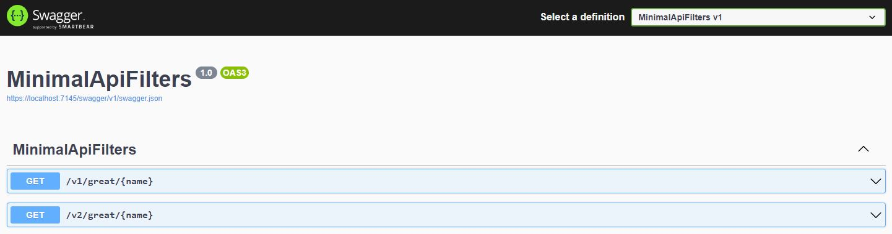

# Route handler filters with .Net 7 preview 3

This is an example of a minimal API written in .Net 7 preview 3. The full article can be found on
[Medium](https://medium.com/@gerhardmaree/route-handler-filters-with-net-7-preview-3-fd98126a3fbb)

